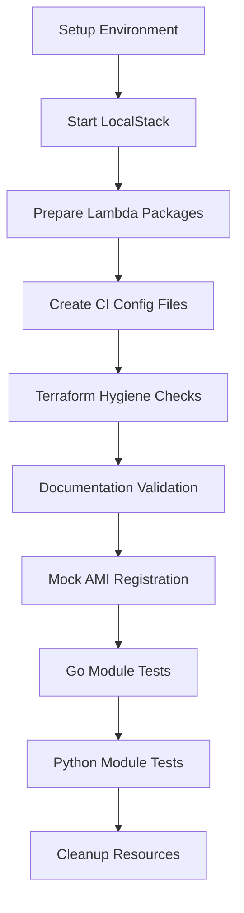

# GitHub Actions CI/CD Workflows

This directory contains automated testing workflows for the LocalStack Terraform Learning Lab. These workflows ensure code quality, validate infrastructure modules, and test across multiple environments.

## 🔄 Workflow Overview

### [`act-test.yml`](./act-test.yml) - Local Testing Workflow
**Purpose**: Lightweight testing designed for local execution with `act` (GitHub Actions simulator)  
**Triggers**: All pushes and pull requests  
**Focus**: Fast feedback for development workflow

### [`terraform-test.yml`](./terraform-test.yml) - Full CI/CD Pipeline  
**Purpose**: Comprehensive testing with multi-environment matrix testing  
**Triggers**: Pushes to `main`, `develop`, `feature/mvp` branches and pull requests  
**Focus**: Production-ready validation across multiple scenarios

---

## 🧪 Testing Structure

### Validation Phases

Both workflows execute these key testing phases:



### 1. **Environment Setup**
- **Go 1.22**: For Terratest-based module validation
- **Python 3.12**: For Python-based infrastructure testing
- **Terraform Latest**: For infrastructure validation and syntax checking

### 2. **LocalStack Integration**
- **Community Edition**: Reliable AWS service emulation for CI
- **Service Selection**: `s3,dynamodb,lambda,apigateway,ec2,iam,kms`
- **Health Checks**: Automated verification of LocalStack readiness
- **Graceful Fallbacks**: Non-blocking failures for optional components

### 3. **Infrastructure Validation**

#### Terraform Hygiene (`scripts/lint_terraform.ps1`)
- **Code Formatting**: `terraform fmt -recursive -check`
- **Initialization**: `terraform init` with provider downloads
- **Provider Validation**: Display and verify provider versions
- **CI-Optimized**: Skips resource validation that requires LocalStack

#### Module Testing Framework
- **Go Tests** (`test/go/`): Terratest-based syntax validation
- **Python Tests** (`test/python/`): Python-terraform wrapper validation
- **Validation-Only**: Tests focus on syntax and configuration correctness
- **Multi-Version**: Tests all module versions (`v0.1.0`, `v0.2.0`)

### 4. **Documentation Validation**
- **Module Documentation**: Verifies all module versions have `README.md` files
- **Cross-Platform**: Works in both local and CI environments
- **Comprehensive Coverage**: Validates documentation for all 8 module types

### 5. **Security & Quality Assurance**
- **Lambda Package Creation**: Automated ZIP file generation for deployment packages  
- **Mock AMI Registration**: Validates AMI registration scripts with LocalStack
- **Dependency Management**: Automated Go module and Python package installation

---

## 🏃‍♂️ Running Workflows Locally

### Prerequisites
```bash
# Install act (GitHub Actions local runner)
# macOS
brew install act

# Linux
curl https://raw.githubusercontent.com/nektos/act/master/install.sh | sudo bash

# Windows
choco install act-cli
```

### Local Execution

#### Quick Validation (act-test.yml)
```bash
# Run the lightweight testing workflow
act -W .github/workflows/act-test.yml

# Run with secrets (if needed)
act -W .github/workflows/act-test.yml -s LOCALSTACK_AUTH_TOKEN="your-token"
```

#### Full Pipeline (terraform-test.yml)
```bash
# Run specific environment matrix
act -W .github/workflows/terraform-test.yml -j deploy

# Run with specific matrix combination
act -W .github/workflows/terraform-test.yml -j deploy --matrix env:develop
```

---

## 🔍 Workflow Details

### ACT-Compatible Testing (`act-test.yml`)

**Design Philosophy**: Optimized for local development and fast feedback

**Key Features**:
- **Single Job**: `local-test` runs all validation phases sequentially
- **LocalStack Community**: Uses free tier for local development
- **Validation Focus**: Emphasizes syntax and configuration validation
- **Fast Execution**: Streamlined for quick developer feedback

**Testing Approach**:
```yaml
- Terraform syntax validation (no resource deployment)
- Module documentation verification
- Go/Python test compilation and basic validation
- Optional LocalStack integration with graceful fallbacks
```

### Production CI/CD (`terraform-test.yml`)

**Design Philosophy**: Comprehensive validation across multiple scenarios

**Matrix Strategy**:
| Environment | Branch | Config File | AMI Environment |
|-------------|--------|-------------|-----------------|
| `feature` | `feature/mvp` | `develop.tfvars` | `develop` |
| `develop` | `develop` | `develop.tfvars` | `develop` |
| `dev` | `main` | `develop.tfvars` | `develop` |
| `nonprod` | `main` | `nonprod.tfvars` | `nonprod` |

**Advanced Features**:
- **Multi-Environment Testing**: Validates different configuration combinations
- **Branch-Specific Execution**: Only runs on appropriate branches
- **LocalStack Pro Support**: Enhanced testing with Pro features when available
- **Comprehensive Integration**: Full LocalStack deployment and testing

---

## 🛡️ Error Handling & Resilience

### Graceful Degradation
- **LocalStack Failures**: Tests continue with validation-only approach
- **AMI Registration**: Non-blocking failures with clear error messages
- **Module Validation**: Individual module failures don't stop entire pipeline
- **Dependency Issues**: Clear error reporting with resolution guidance

### Common Issues & Solutions

#### LocalStack Connection Issues
```bash
# Symptoms: "Connection refused" or "timeout" errors
# Solution: Workflow automatically falls back to validation-only testing
# Debug: Check LocalStack container logs in workflow output
```

#### Module Path Resolution
```bash
# Symptoms: "No such file or directory" for module paths
# Solution: Tests use absolute path resolution with comprehensive error reporting
# Debug: Check path debugging output in test failure logs
```

#### Terraform Provider Issues
```bash
# Symptoms: Provider initialization failures
# Solution: Workflows use specific provider versions and endpoint configuration
# Debug: Review terraform init output in workflow logs
```

---

## 📊 Test Coverage

### Module Coverage Matrix

| Module | Go Tests | Python Tests | Documentation | Examples |
|--------|----------|--------------|---------------|----------|
| **API Gateway** | ✅ v0.1.0, v0.2.0 | ✅ v0.1.0, v0.2.0 | ✅ | ✅ |
| **DynamoDB** | ✅ v0.1.0, v0.2.0 | ✅ v0.1.0, v0.2.0 | ✅ | ✅ |
| **EC2** | ✅ v0.1.0, v0.2.0 | ✅ v0.1.0, v0.2.0 | ✅ | ✅ |
| **IAM** | ✅ v0.1.0, v0.2.0 | ✅ v0.1.0, v0.2.0 | ✅ | ✅ |
| **KMS** | ✅ v0.1.0, v0.2.0 | ✅ v0.1.0, v0.2.0 | ✅ | ✅ |
| **Lambda** | ✅ v0.1.0, v0.2.0 | ✅ v0.1.0, v0.2.0 | ✅ | ✅ |
| **S3** | ✅ v0.1.0, v0.2.0 | ✅ v0.1.0, v0.2.0 | ✅ | ✅ |
| **VPC** | ✅ v0.1.0, v0.2.0 | ✅ v0.1.0, v0.2.0 | ✅ | ✅ |

### Testing Methodology

**Syntax Validation**:
- Terraform configuration syntax and structure
- Provider version compatibility
- Variable and output definitions
- Module interdependencies

**Documentation Validation**:
- README.md existence and structure
- Module version documentation completeness
- Example configuration validity

**Integration Testing**:
- LocalStack service connectivity (when available)
- AWS provider endpoint configuration
- Mock resource registration capabilities

---

## 🔧 Maintenance & Updates

### Dependency Updates
- **Terraform**: Update `hashicorp/setup-terraform` action version
- **Go**: Update `actions/setup-go` version and Go version in matrix
- **Python**: Update `actions/setup-python` version and Python version
- **Terratest**: Update version in `go.mod` when new releases are available

### Workflow Modifications
- **Adding New Modules**: Update test coverage matrix and add corresponding tests
- **Environment Changes**: Modify matrix strategy in `terraform-test.yml`
- **LocalStack Updates**: Adjust service configuration and health check endpoints

### Performance Optimization
- **Parallel Execution**: Tests run in parallel where possible
- **Caching**: Go modules and Python packages are cached between runs
- **Selective Execution**: Matrix conditions prevent unnecessary runs

---

## 📚 Additional Resources

- **[Main README](../../README.md)**: Complete project documentation and learning guide
- **[Testing Documentation](../../test/README.md)**: Detailed testing framework documentation
- **[LocalStack Documentation](https://docs.localstack.cloud/)**: Official LocalStack documentation
- **[Terratest Documentation](https://terratest.gruntwork.io/)**: Go testing framework for infrastructure
- **[Act Documentation](https://github.com/nektos/act)**: Local GitHub Actions runner

---

## 🤝 Contributing

When contributing to the workflows:

1. **Test Locally First**: Use `act` to validate changes before pushing
2. **Update Documentation**: Ensure this README reflects any workflow changes
3. **Maintain Compatibility**: Keep both workflows compatible with their design goals
4. **Add Test Coverage**: Include tests for new modules or functionality
5. **Performance Awareness**: Consider CI execution time in modifications

---

*These workflows ensure the LocalStack Terraform Learning Lab maintains high quality and reliability while providing fast feedback for developers and comprehensive validation for production readiness.*